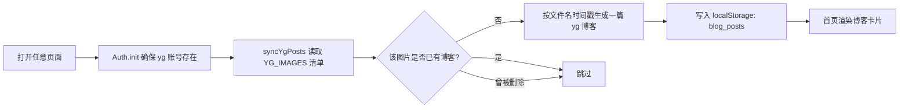

# 梗指北（纯前端简易博客 · localStorage 持久化）

**梗指北**是一个零依赖的极简博客系统：**用户注册、登录、发布图文博客、文字评论、单篇博客详情页、首页双分区（管理员博客 / 用户博客）、用户博客专区、意见反馈窗口**。
不需要后端服务器、不需要安装任何依赖，**用浏览器直接打开 `index.html` 就能运行**，所有数据保存在浏览器本地 `localStorage`，刷新页面数据不丢失。

---

## 一、快速开始

1. 下载 / 克隆整个项目文件夹（保持目录结构不变）。
2. 双击打开 `index.html`（推荐 Chrome / Edge / Firefox 最新版）。
3. 首页会自动生成管理员 **yg** 的图片博客列表，无需任何初始化操作。

> 说明：项目采用相对路径引用（`css/style.css`、`js/main.js`、`images/xx.jpg`），
> 因此**不要单独移动某个 html 文件**；整个文件夹可以随意挪动位置。
> 若要通过 `http://` 访问，可在项目根目录执行 `python -m http.server 8000` 后访问 `http://localhost:8000`。

### 部署到 GitHub Pages（可选）

1. 在 GitHub 新建一个**空仓库**（例如 `gzn16`），**不要**勾选自动生成 README / .gitignore。
2. 把本项目全部文件上传上去（两种方式任选）：
   - **网页上传**：仓库页点 `Add file → Upload files`，把整个文件夹里的内容拖进去 → `Commit changes`；
   - **命令行**：
     ```bash
     cd gzn16
     git init && git add . && git commit -m "first commit"
     git branch -M main
     git remote add origin https://github.com/<你的用户名>/<仓库名>.git
     git push -u origin main
     ```
3. 仓库 `Settings → Pages` → **Source** 选 `Deploy from a branch`，分支选 `main`、目录选 `/ (root)` → `Save`。
4. 等待 1–2 分钟，访问 `https://<你的用户名>.github.io/<仓库名>/` 即可。

> 项目全部使用相对路径，因此部署在仓库**子路径**下也能正常工作；仓库已包含 `.nojekyll`，避免 GitHub Pages 对静态资源做多余的 Jekyll 处理。

---

## 二、目录结构

```
gzn16/
├── index.html          // 博客首页：左侧目录栏 + 管理员/用户双分区 + 搜索筛选 + 评论
├── user.html           // 用户博客专区：用户博客列表 + 发布提示 + 发布入口
├── post.html           // 单篇博客详情页（通过 ?id=博客id 打开）
├── profile.html        // 用户主页（通过 ?name=用户名 打开）：头像/昵称/真实姓名 + TA 的博客
├── mg.html             // 可视化管理后台（仅管理员 yg）：用户/博客/评论/反馈/数据管理
├── login.html          // 登录页面
├── register.html       // 注册页面
├── publish.html        // 发布博客页面（文字 + 图片）
├── README.md           // 本说明文档
├── css/
│   └── style.css       // 全局样式（简约风格 + 移动端适配）
├── js/
│   └── main.js         // 全部业务逻辑（注册/登录/发布/评论/详情/本地存储）
├── data/
│   └── admin-posts.json// 管理员博客文字覆盖（编辑后导出并提交到仓库即全站生效）
└── images/             // 博客配图：一张图片 = yg 的一篇博客
    └── wx_camera_*.jpg
```

---

## 三、功能清单

| 功能 | 说明 |
| --- | --- |
| 用户注册 | 用户名 2–16 位（字母/数字/下划线/中文）、**真实姓名 2–20 字（必填）**、密码至少 6 位、两次密码需一致；用户名不可重复；`yg` 为管理员保留名不可注册；注册成功后自动登录 |
| **真实姓名** | 注册时必填，平时**不在博客卡片、评论区等处展示**；点击某用户的头像或昵称进入其个人主页时，才能看到真实姓名；管理后台也可查看 |
| **用户主页** | `profile.html?name=用户名`：展示该用户头像、昵称、角色、**真实姓名**、注册时间、博客/评论数，以及 TA 发布的全部博客；若查看的是自己，还提供「发布博客 / 更换头像」入口 |
| 用户登录 | 用户名 + 密码校验，登录状态写入 `localStorage`，刷新页面仍保持登录 |
| 退出登录 | 导航栏「退出登录」按钮，清除登录状态 |
| **上传头像** | 登录用户可上传图片作为头像：导航栏头像、博客卡片、评论区、详情页、专区提示卡与后台用户表都会同步显示；图片自动居中裁剪为正方形（256×256、JPEG）后存入本地存储，也可一键移除头像（移除后显示用户名首字符） |
| 发布博客 | 需登录；支持「文字描述 + 图片」，标题必填（≤60 字）、正文必填（≤5000 字）、图片可选 |
| 博客评论 | 需登录；**仅支持文字评论**（≤500 字），支持回车快捷提交 |
| **单篇博客详情** | 点击卡片标题或「阅读全文 →」进入 `post.html?id=xxx`：大图完整展示、完整正文不折叠、完整评论区、上一篇/下一篇导航 |
| **左侧目录栏** | 首页左侧固定「博客目录」：🖼️ 管理员博客 / ✍️ 用户博客（各带实时数量）。点击平滑滚动到对应分区，滚动时自动高亮当前分区；窄屏（≤900px）自动变成内容上方的横向条目 |
| **首页双分区** | 首页按作者分为「🖼️ 管理员博客」（yg 发布的，含图片自动生成的随笔）与「✍️ 用户博客」（普通用户发布的）两个分区，各自带标题、说明、数量与「展开更多 / 收起」 |
| **全站提示横幅** | 所有页面顶部导航下方都会显示一条醒目的提示横幅：「梗指北早已完结，我们的故事仍在继续」 |
| **意见反馈窗口** | 所有页面右下角悬浮「意见反馈」按钮，点开后可选择反馈类型（功能建议 / 问题反馈 / 内容纠错 / 其他）、填写反馈内容（≤500 字）与选填联系方式；未登录也可提交，反馈保存在本地存储 |
| **可视化管理后台** | `mg.html`（简称 mg）：统计卡片 + 五个页签：👤 用户管理（查看用户**用户名 / 真实姓名 / 明文密码** / 注册时间，改用户名/真实姓名/密码/角色、删除用户并级联清理其博客评论）、📄 博客管理（改标题正文、删除）、💬 评论管理（改内容、删除）、📮 反馈管理（查看 / 删除用户反馈）、💾 数据管理（导出 / 导入 JSON、清空全部数据）；仅管理员 yg 可进入 |
| **编辑管理员博客文字** | 管理员 yg 在**管理员博客卡片或详情页**点「✏️ 编辑文字」即可改标题/正文；改动先在本机生效，再到「管理后台 → 数据管理」下载 `admin-posts.json` 提交到仓库 `data/` 目录，所有访客刷新后即可看到（无需后端、无需令牌） |
| **用户博客专区** | `user.html`：集中展示普通用户发布的博客，提供状态提示、发布须知、发布入口与「全部用户博客 / 我的博客」筛选 |
| 删除博客 | 作者本人可删自己的博客，管理员 `yg` 可删任意博客；删除博客会级联删除其全部评论 |
| 删除评论 | 评论作者本人或管理员 `yg` 可删除 |
| 搜索与筛选 | 按标题/正文/作者关键词搜索；筛选「全部博客 / 我的博客」 |
| 图片查看 | 点击博客配图可放大查看（遮罩层，点击任意处关闭） |
| 长文折叠 | 正文超过 200 字自动折叠，可「展开全文 / 收起」 |

---

## 四、账号与权限

### 内置管理员账号

| 用户名 | 密码 | 角色 |
| --- | --- | --- |
| `yg` | `yg123456` | 管理员（最高权限） |

> 管理员账号在首次打开页面时自动写入本地存储，不可被注册占用。
> 如需修改默认密码，请在 `js/main.js` 中修改 `ADMIN_DEFAULT_PASSWORD`（修改后需清空浏览器本地存储才会重新生效）。

### 权限矩阵

| 操作 | 未登录 | 普通用户 | 管理员 yg |
| --- | :---: | :---: | :---: |
| 查看博客列表 | ✅ | ✅ | ✅ |
| 注册 / 登录 | ✅ | — | — |
| 上传 / 更换自己的头像 | ❌ | ✅ | ✅ |
| 发布博客 | ❌ | ✅ | ✅ |
| 发表文字评论 | ❌ | ✅ | ✅ |
| 提交意见反馈 | ✅ | ✅ | ✅ |
| 删除自己的博客 / 评论 | ❌ | ✅ | ✅ |
| 删除他人的博客 / 评论 | ❌ | ❌ | ✅ |
| 进入管理后台 `mg.html` | ❌ | ❌ | ✅ |
| 查看他人主页（含真实姓名） | ✅ | ✅ | ✅ |
| 查看用户明文密码 | ❌ | ❌ | ✅ |
| 修改 / 删除任意用户（级联清理其博客与评论） | ❌ | ❌ | ✅ |
| 修改 / 删除任意博客、任意评论 | ❌ | ❌ | ✅ |
| 查看 / 删除用户反馈 | ❌ | ❌ | ✅ |
| 导出 / 导入 / 清空全部数据 | ❌ | ❌ | ✅ |

未登录用户访问「发布博客」会自动跳转至登录页；在首页点击「我的博客」也会提示先登录。

---

## 五、使用说明（操作流程）

### 1. 浏览博客（无需登录）
- 打开 `index.html`，页面左侧是**目录栏「博客目录」**，右边是内容区：
  - 点目录里的「管理员博客 / 用户博客」会平滑滚动到对应分区，并在滚动时自动高亮当前正在看的分区；
  - 每个目录项右侧实时显示该分区的博客数量，目录底部还有「发布我的博客」快捷按钮；
  - 屏幕宽度 ≤900px 时目录栏会自动变成内容上方的横向条目（手机上依然可用）。
- 内容区按作者**分为两个分区**：
  - **🖼️ 管理员博客**：管理员 yg 发布的博客（`images` 图片自动生成的图片随笔 + yg 手动发布的），默认显示 6 篇；
  - **✍️ 用户博客**：普通用户发布的博客，默认显示 6 篇，右上角有「进入用户博客专区 →」入口。
- 每个分区都有独立的标题、说明与数量统计；内容超过 6 篇时，底部出现「展开更多（还有 N 篇）」按钮，全部展开后可点「收起」。
- 顶部工具栏的关键词搜索（标题 / 正文 / 作者）会**同时过滤两个分区**，且搜索时分区不再分批显示；「全部博客 / 我的博客」可快速只看自己发布的内容（需登录）。
- 卡片展示：图片 + 标题 + 正文 + 发布人 + 发布时间 + 评论数 + 评论区；点击图片可放大，点击标题或「阅读全文 →」进入详情页。

### 2. 打开单篇博客详情
- 在卡片上点击**标题文字**或**「阅读全文 →」**，即可进入该博客的独立详情页。
- 详情页地址形如：`post.html?id=yg-wx_camera_1755161779231`，特点：
  - 配图**完整显示不裁切**，点击可放大；
  - 正文**完整展示**，不再折叠；
  - 包含完整评论区，可直接评论、删除自己的评论；
  - 底部提供「上一篇 / 下一篇」导航（按发布时间顺序）。
  - 浏览器标签标题会自动换成当前博客名，如「日常记录 · 45 · 梗指北」。
- 若博客不存在或已被删除，会显示「没有找到这篇博客」并提供返回首页入口。

### 3. 用户博客专区（发布博客的主要入口）
入口有两个：导航栏的「用户专区」，以及首页顶部的蓝色入口横幅。

- **未登录时**：专区顶部显示黄色提示卡「你还未登录」，给出「去登录 / 注册新账号」按钮；点击「我的博客」或「发布我的博客」会提示并跳转登录页。
- **已登录且未发布过**：提示卡显示「欢迎你，xxx！你还没有在专区发布过博客」，并提供「发布我的博客」按钮。
- **已登录且发布过**：提示卡会告知你已发布多少篇，并提供「发布我的博客 / 查看我的博客」按钮。
- 页面中部是「📌 发布须知」，明确告知登录要求、内容形式（文字 + 图片）、评论限制、删除权限与数据存储位置。
- 专区列表支持关键词搜索与「全部用户博客 / 我的博客」筛选；列表为空时显示发布引导按钮。
- 发布入口：点击「发布我的博客 / 去发布我的博客」→ 进入 `publish.html`；**普通用户发布成功后会自动回到用户专区**（管理员 yg 发布后回首页）。

> 专区只收录**普通用户发布的博客**（作者不是 yg）；管理员 yg 发布的博客在首页「管理员博客」分区与首页列表中查看。

### 4. 注册账号
1. 进入 `register.html`（导航栏「注册」）。
2. 填写用户名、真实姓名、密码、确认密码 → 点击「注册并登录」。
3. 注册成功后自动登录并跳回首页，导航栏显示当前用户名。

### 5. 登录 / 退出
1. 进入 `login.html`（导航栏「登录」），输入用户名与密码。
2. 登录成功跳回首页；导航栏出现「发布博客」和「退出登录」。
3. 点击「退出登录」即清除登录状态。

### 6. 上传 / 更换头像
登录后，以下两种方式都能打开「更换头像」弹窗：
1. 在**用户博客专区**顶部提示卡中点击「更换头像」按钮；
2. 进入**自己的用户主页**（点击导航栏/卡片上你的头像或昵称），点击「更换头像」按钮。

弹窗操作：
- 点击「选择文件」（或直接选择图片）→ 自动居中裁剪为正方形并压缩预览，点击「保存头像」生效；
- 点击「移除头像」可恢复为用户名首字符的默认占位样式；
- 支持 jpg / png / gif / webp，原图不超过 2MB；
- 保存后无需刷新，导航栏、博客卡片、评论区、详情页、用户专区与后台用户表中的头像会立即更新。

> 头像以 Base64（dataURL）形式保存在浏览器 localStorage 中，默认未设置头像时显示用户名首字符（如 `yg` 显示 `Y`）。

### 7. 发布博客
1. 登录后点击导航栏「发布博客」进入 `publish.html`。
2. 填写标题、文字描述；可选上传一张配图（选中后立即预览）。
3. 点击「发布」→ 提示成功后自动返回首页，新博客出现在列表最前面。

### 8. 发表 / 删除评论
- 在任意博客卡片底部的「评论区」输入文字 → 点击「发表评论」或按回车。
- 评论立即显示；自己的评论（或管理员）右侧有「删除」按钮。

### 9. 删除博客
- 自己发布的博客（或管理员任意博客）在**首页卡片或详情页**上都有「删除博客」按钮，确认后删除；在详情页删除后会返回首页。

### 10. 重置数据
如需恢复到初始状态（清空所有用户、博客、评论），在浏览器中按 `F12` 打开控制台，执行：

```js
localStorage.clear(); location.reload();
```

刷新后会自动重建管理员 `yg` 与 45 篇图片博客。

### 11. 可视化管理后台（mg.html）

仅**管理员 yg** 可用。入口：登录 yg 后，导航栏会出现「管理后台」按钮（普通用户看不到；直接输网址进入会看到「你没有权限」提示）。

**顶部统计**：注册用户数、博客总数（自动生成 / 手动·用户）、评论总数、用户反馈数、localStorage 占用。

| 页签 | 能做什么 |
| --- | --- |
| 👤 用户管理 | 表格列出所有用户（用户名、**真实姓名**、**密码（默认掩码，可点「显示」查看明文）**、注册时间、博客数、评论数）；**编辑**：改用户名 / 改真实姓名 / 改新密码（留空不动）/ 改角色；**删除**：删除用户并**级联删除**其所有博客与评论。管理员 yg 的删除按钮被禁用，用户名与角色也受保护 |
| 📄 博客管理 | 列出全部博客（含图片自动生成的）；**编辑**：改标题与正文；**删除**：连同其评论一起删除 |
| 💬 评论管理 | 列出全部评论（含所属博客链接）；**编辑**：改评论内容；**删除**：删除该评论 |
| 📮 反馈管理 | 列出所有用户提交的意见反馈（类型 / 内容 / 提交者 / 联系方式 / 时间）；**删除**：删除该条反馈 |
| 💾 数据管理 | **导出**：把全部数据（用户 / 博客 / 评论 / 反馈）下载为 JSON 备份；**导入**：选择 JSON 文件覆盖当前数据（导入后需重新登录）；**清空**：一键删除所有用户/博客/评论/反馈（刷新后重建 yg 与 45 篇图片随笔）；另外提供「📝 管理员博客文字 · 同步到仓库」下载 `admin-posts.json` |

编辑类操作都通过弹窗表单完成（弹窗内 `Ctrl / Cmd + Enter` 可快捷保存），删除类操作都会先弹确认框。

> 改用户名的连带效果：该用户所有博客与评论显示的作者名会一起更新（若改的是当前登录用户，登录状态同步更新）。

### 12. 系统会给出哪些用户提示

提示随登录状态与数据变化自动更新，专区提示的实现位置在 `js/main.js` 的 `buildZoneTipHtml()`：

| 场景 | 提示内容 | 附带操作 |
| --- | --- | --- |
| 专区 · 未登录 | 黄色提示卡「你还未登录」+ 专区现有博客数 | 去登录 / 注册新账号 |
| 专区 · 已登录未发布 | 「欢迎你，xxx！你还没有在专区发布过博客」 | 发布我的博客 |
| 专区 · 已登录已发布 | 「你已在专区发布 N 篇博客，可继续发布，也可以删除自己的博客与评论」 | 发布我的博客 / 查看我的博客 |
| 专区 · 列表为空 | 空状态文案 + 发布引导 | 去发布我的博客 / 返回首页 |
| 专区 · 未登录点「我的博客」 | 轻提示「请先登录后查看「我的博客」」 | 自动跳转登录页 |
| 专区 · 发布须知卡 | 登录要求、内容形式、评论限制、删除权限、数据存储位置 | — |
| 首页 · 用户博客分区为空 | 「用户博客里还没有匹配的内容」+ 发布引导 | 去发布我的博客 / 进入用户博客专区 |
| 首页 · 分区数量 | 「共 N 篇」或「共 N 篇（已显示 M 篇）」；顶部汇总「共 N 篇博客（管理员 A · 用户 B）」 | 展开更多 / 收起 |
| 首页横幅 | 未登录：「专区已有 N 篇用户博客，登录后即可发布…」；已登录：「已登录 xxx，专区现有 N 篇，你已发布 M 篇」 | 进入专区 / 我要发布 |
| 发布页 | 「发布成功后你的博客会出现在首页的「用户博客」分区，并同步显示在用户博客专区」+ 图片会压缩的提醒 | — |
| 表单校验 | 「密码至少 6 位」「该用户名已被注册」「本地存储空间不足，请删除一些含图片的博客后重试」等具体原因 | — |

### 13. 编辑管理员博客文字并同步到仓库

管理员 yg 可以修改「管理员博客」（yg 的图片随笔）的标题与正文：

1. 在**首页「管理员博客」分区的卡片**或**博客详情页**，点「✏️ 编辑文字」；
2. 修改标题 / 正文 → 「保存」，改动立即在本机生效；
3. 打开「管理后台 → 数据管理」，在「📝 管理员博客文字 · 同步到仓库」里点 **下载 admin-posts.json**；
4. 把下载的文件在仓库里覆盖 `data/admin-posts.json`（网页端：进入 `data/` 目录 → 上传文件 → 提交），提交后所有访客刷新即可看到更新。

> **优先级**：本地编辑 > 仓库 `data/admin-posts.json` > `js/main.js` 里的 `YG_IMAGE_TEXT` > 自动生成词库。
> 用 `file://` 直接双击打开时，浏览器不允许读取该 JSON，此时只使用本地编辑；部署到 GitHub Pages 等 http(s) 环境才会读取仓库文件。

---

## 六、images 与 yg 博客的自动生成逻辑



- **一张图片对应一篇博客**，作者固定为管理员 `yg`，发布时间取自文件名中的毫秒时间戳（`wx_camera_<时间戳>.jpg`）。
- 浏览器出于安全限制无法枚举本地目录，因此图片清单以常量数组 `YG_IMAGES` 的形式**预先写在 `js/main.js` 中**。
- 每次打开页面都会执行一次同步：清单中「还没有对应博客」的图片会自动补生成一条博客；已删除的不会复活。

### 新增一篇 yg 的博客
1. 把图片放进 `images/` 文件夹；
2. 在 `js/main.js` 的 `YG_IMAGES` 数组中追加一行：

```js
{ file: '你的图片名.jpg', time: '2025-08-15 09:30' },
```

3. 刷新首页即可看到新博客（无需改动其它代码）。

### 自定义某张图片的标题与正文
在 `js/main.js` 的 `YG_IMAGE_TEXT` 中按文件名覆盖（未配置的图片使用标题/正文词库自动生成）：

```js
var YG_IMAGE_TEXT = {
  'wx_camera_1755160979291.jpg': {
    title: '我的第一篇博客',
    content: '这里写你自己的正文内容…\n支持换行。'
  }
};
```

---

## 七、数据存储说明（localStorage）

| Key | 内容 | 数据结构示例 |
| --- | --- | --- |
| `blog_users` | 用户列表 | `[{ id, username, password, passwordPlain, realName, role, avatar, createdAt }]` |
| `blog_posts` | 博客列表 | `[{ id, title, content, image, author, authorRole, source, createdAt }]` |
| `blog_comments` | 评论列表 | `[{ id, postId, author, content, createdAt }]` |
| `blog_feedback` | 用户反馈列表 | `[{ id, type, content, contact, author, createdAt }]` |
| `blog_admin_text` | 管理员博客文字的本地覆盖（待提交到仓库） | `{ '<postId>': { title, content } }` |
| `blog_session` | 当前登录状态 | `{ username, loginAt }` |
| `blog_removed_posts` | 被删除的预置博客 id | `['yg-wx_camera_1755161779231']` |

字段说明：
- `password`：密码的简易哈希（djb2 变体），用于登录校验；`passwordPlain`：明文密码，仅供管理后台展示。
- `realName`：真实姓名，注册时必填，仅在用户主页与管理后台可见。
- `image`：yg 的预置博客存图片相对路径（如 `images/xxx.jpg`）；用户上传的图片经压缩后存 `dataURL`（Base64）。
- `source`：`seed` = 由图片清单自动生成，`user` = 用户发布。
- `role`：`admin` = 管理员，`user` = 普通用户。
- `avatar`：用户头像的 `dataURL`（Base64），未设置为空串 `''`时会显示用户名首字符占位。
- `content`：保留用户输入的换行符（`\n`）。

**存储容量提示**：localStorage 通常上限约 5MB。用户上传的图片会自动压缩（最长边 1280px、JPEG 质量 0.82）后再存储，头像会先居中裁剪为正方形并压缩为 256×256 的 JPEG（质量 0.85，原图上限 2MB）；若空间不足会提示「本地存储空间不足，请删除一些含图片的博客后重试」。

---

## 八、二次开发提示

- 全部逻辑集中在 `js/main.js`，顶层按「配置常量 → 通用工具 → 存储层 `Store` → 用户 `Auth` → 图片清单 → 博客 `Posts` → 评论 `Comments` → 视图层」分节，注释充足。
- 调试时可在浏览器控制台直接调用：

```js
BlogApp.Posts.list({ filter: 'yg' }).length   // yg 的博客数量
BlogApp.Posts.list({ zoneOnly: true }).length // 用户博客专区（普通用户博客）数量
BlogApp.Auth.current()                        // 当前登录用户
BlogApp.Comments.countByPost('yg-wx_camera_1755160979291')  // 某篇博客的评论数
BlogApp.syncYgPosts()                         // 手动触发图片同步

// 管理后台（可视化管理员 mg）的数据操作
BlogApp.Mg.stats()                            // 统计数据
BlogApp.Mg.exportData()                       // 导出 JSON
BlogApp.Mg.importData(jsonText)               // 导入 JSON（覆盖，需重新登录）
BlogApp.Mg.updateUser(id, { username, realName, password, role })  // 留空的 realName / password 表示不修改
BlogApp.Mg.removeUser(id)                     // 删除用户 + 级联清理
BlogApp.Mg.clearAll()                         // 清空全部数据
```

- 想增删左侧目录栏的条目（例如再加一个分区）：
  1. 在 `index.html` 的 `#sidebarNav` 里复制一个 `.sidebar__item`，改 `data-target` 为分区容器 id；
  2. 在 `js/main.js` 的 `SIDEBAR_TARGETS` 数组里同步加上该 id 即可（滚动高亮会自动适配）。

- 常用可调参数位于 `js/main.js` 顶部的 `LIMITS`：

```js
var LIMITS = {
  usernameMin: 2, usernameMax: 16, passwordMin: 6,
  realNameMin: 2, realNameMax: 20,
  titleMax: 60, contentMax: 5000, commentMax: 500,
  imageMaxMB: 5, imageMaxSide: 1280, imageQuality: 0.82,
  avatarMaxMB: 2, avatarSize: 256, avatarQuality: 0.85,
  feedbackMax: 500, feedbackContactMax: 80
};
```

- 主题换色：修改 `css/style.css` 顶部 `:root` 中的 `--color-primary` 等变量即可整体换肤。

### 按钮样式规范（全局统一）

所有按钮共用同一套外形，只有配色区分语义，新增按钮时**不要单独写尺寸**：

| 类名 | 用途 | 外观 |
| --- | --- | --- |
| `.btn` | 基础样式（默认外观） | 白底 + 灰描边 + 深灰字 |
| `.btn.btn--primary` | 主要操作（提交、发布、进入） | 蓝底白字 |
| `.btn.btn--ghost` | 次要操作（返回、展开更多、退出） | 白底 + 灰描边 + 灰字 |
| `.btn.btn--danger` | 危险操作（删除） | 白底 + 红描边 + 红字 |
| `.btn.btn--block` | 宽度占满一行（表单提交用） | 同 `.btn`，仅 `width: 100%` |

统一规格：高度 `36px`、左右内边距 `16px`、字号 `14px`、圆角 `6px`、`1px` 边框，水平垂直居中，`inline-flex` 布局（`a.btn` 也不会出现下划线）。

> 例外：首页工具栏的「全部博客 / 我的博客」是**分段切换控件**（`.segmented button`，标签页式外观），不属于 `.btn` 体系。

---

## 九、常见问题

**Q1：刷新页面数据会不会丢？**
不会。数据保存在浏览器 `localStorage` 中，刷新、关闭再打开都在。

**Q2：换个浏览器 / 换台电脑能看到我的数据吗？**
不能。`localStorage` 是按「浏览器 + 站点」隔离的本地存储，不同浏览器或不同设备互不相通；清除浏览器数据也会一并清除。

**Q3：删除 yg 的预置博客后，刷新又出现了？**
不会。删除的预置博客 id 会记录在 `blog_removed_posts` 中，不会重新生成。若执行了 `localStorage.clear()` 则会恢复初始状态。

**Q4：上传图片后提示存储空间不足？**
localStorage 总容量约 5MB，请减少含图片的博客数量，或改用体积更小的图片。可适当调低 `LIMITS.imageMaxSide` / `LIMITS.imageQuality`。

**Q5：密码是怎么保存的？**
登录校验用的是简易哈希（`password` 字段，djb2 变体，不是安全加密）；同时为了管理后台能查看明文，另外保存了一份 `passwordPlain` 明文。两者都只是演示用途，纯前端项目不存在真正的安全边界，**请勿存入真实敏感数据或用于生产环境**。

**Q6：为什么不能直接列出 images 文件夹里的所有图片？**
浏览器安全策略禁止网页枚举本地目录内容，因此采用「预先写好清单 + 自动同步」的方式实现，详见第六节。

**Q7：详情页链接可以直接分享给别人吗？**
可以连同项目文件夹一起分享。但数据存在各人自己的浏览器 `localStorage` 里，对方打开 `post.html?id=xxx` 时看到的是**他自己浏览器中的数据**；若没有该项目文件夹（图片路径失效），图片会显示不出来。

**Q8：为什么用户博客专区里看不到 yg 的那些图片博客？**
专区按「作者是否为 yg」过滤，只收录普通用户发布的博客；yg 发布的图片随笔（`source === 'seed'`，由 `images` 图片清单自动生成）与 yg 手动发布的博客都归在首页「管理员博客」分区。这样用户内容与管理员内容就完全分开了。

---

## 十、技术栈与兼容性

- 技术：原生 HTML5 + CSS3 + JavaScript（以 ES5 风格书写，IIFE 封装，无构建、无依赖）。
- 使用到的浏览器能力：`localStorage`、`FileReader`、`Canvas`、CSS Grid / `aspect-ratio`、`Promise`、`Element.closest`、`Array.prototype.find`、`String.prototype.padStart` 等。
- 兼容：Chrome / Edge / Firefox / Safari 现代版本，移动端浏览器同样适配（≤640px 自动切换单列布局）。

---

## 十一、许可

仅供学习与个人使用，可自由修改与分发。
