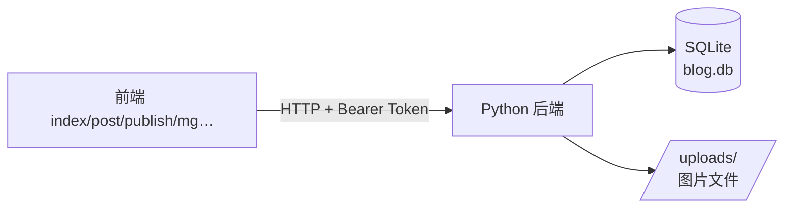

# 梗指北 · 后端服务

一个**零第三方依赖**的 Python 后端（仅用标准库），为前端提供跨设备共享的数据接口：
用户注册登录、博客、评论、意见反馈、头像与配图上传、以及管理员全部操作。

数据存放在本地 **SQLite**（`data/blog.db`），上传的图片存放在 `data/uploads/`。
不装任何包，`python run.py` 即可运行；也可直接部署到任意服务器。



---

## 一、快速开始

```bash
# 1. 进入 server 目录（或直接用绝对路径）
cd server

# 2. 启动服务（首次启动自动建表并写入 45 篇 yg 图片随笔）
python run.py

# 3. 另开一个终端做接口自检
python smoke_test.py http://127.0.0.1:8000
```

启动后：

| 地址 | 说明 |
| --- | --- |
| `http://127.0.0.1:8000/api/health` | 健康检查，确认服务在跑 |
| `http://127.0.0.1:8000/api/posts` | 博客列表（JSON） |
| `http://127.0.0.1:8000/uploads/<文件名>` | 上传的图片访问地址 |

内置管理员：用户名 `yg`，密码 `yg123456`。

### 常用启动参数

```bash
python run.py --port 9000            # 换端口
python run.py --host 0.0.0.0         # 允许局域网 / 外网访问
```

---

## 二、环境变量

全部可选，不设置时使用括号中的默认值：

| 变量 | 默认值 | 说明 |
| --- | --- | --- |
| `BLOG_HOST` | `127.0.0.1` | 监听地址（部署时用 `0.0.0.0`） |
| `BLOG_PORT` | `8000` | 监听端口 |
| `BLOG_DATA_DIR` | `server/data` | 数据目录 |
| `BLOG_DB` | `server/data/blog.db` | SQLite 文件位置 |
| `BLOG_UPLOAD_DIR` | `server/data/uploads` | 图片存放目录 |
| `BLOG_CORS_ORIGINS` | `*` | 允许的前端来源。**上线请改成你的域名**，如 `https://你的用户名.github.io` |
| `BLOG_SESSION_TTL_DAYS` | `30` | 登录令牌有效期（天） |

---

## 三、目录结构

```
server/
├── run.py                      # 启动入口
├── smoke_test.py               # 接口自检脚本
├── README.md
├── data/                       # 运行时生成（已 gitignore）
│   ├── blog.db                 #   SQLite 数据库
│   └── uploads/                #   上传的图片
└── app/
    ├── config.py               # 配置与业务限制常量
    ├── util.py                 # 时间 / id / 校验工具
    ├── security.py             # 密码哈希（PBKDF2）与令牌
    ├── db.py                   # SQLite 连接与建表
    ├── auth.py                 # 登录会话
    ├── http.py                 # 请求封装 / multipart 解析 / 错误类型
    ├── router.py               # 极简路由表
    ├── serializers.py          # 数据行 → 前端 JSON
    ├── storage.py              # 图片保存与 URL 拼接
    ├── seed.py                 # 管理员与 45 篇图片随笔种子
    ├── server.py               # HTTP 服务器与分发
    └── api/                    # 各业务接口
        ├── auth_api.py         #   注册 / 登录 / 退出 / 当前用户
        ├── users_api.py        #   主页 / 改资料 / 头像 / 管理员管用户
        ├── posts_api.py        #   博客增删改查
        ├── comments_api.py     #   评论
        ├── feedback_api.py     #   意见反馈
        └── admin_api.py        #   统计 / 导出导入 / 清空 / 文字覆盖
```

---

## 四、认证方式

除公开接口外，都需要在请求头携带登录令牌：

```
Authorization: Bearer <token>
```

令牌由 `/api/auth/register` 与 `/api/auth/login` 返回，前端自行保存
（可继续用 `localStorage`，也可只放内存）。密码使用 **PBKDF2-HMAC-SHA256 + 随机盐** 存储，
**任何接口都不会返回密码或密码哈希**。

> 与原纯前端版本的重要区别：原版为「管理员查看明文密码」保存了 `passwordPlain`，
> 后端版本已彻底移除该字段与相关功能，这是接入真实后端后必须做的安全调整。

---

## 五、接口一览

### 认证

| 方法 | 路径 | 权限 | 说明 |
| --- | --- | --- | --- |
| POST | `/api/auth/register` | 公开 | 注册（`username` / `password` / `password2` / `realName`） |
| POST | `/api/auth/login` | 公开 | 登录，返回 `token` 与 `user` |
| POST | `/api/auth/logout` | 登录 | 退出，销毁当前令牌 |
| GET | `/api/auth/me` | 登录 | 当前登录用户 |

### 用户

| 方法 | 路径 | 权限 | 说明 |
| --- | --- | --- | --- |
| GET | `/api/users/me` | 登录 | 本人信息 |
| PATCH | `/api/users/me` | 登录 | 改真实姓名 / 密码 |
| POST | `/api/users/me/avatar` | 登录 | 上传头像（multipart，字段 `file`） |
| DELETE | `/api/users/me/avatar` | 登录 | 移除头像 |
| GET | `/api/users/:username` | 公开 | 用户主页（含真实姓名、博客/评论数） |
| GET | `/api/users` | 管理员 | 用户列表（含统计，不含密码） |
| PATCH | `/api/users/:id` | 管理员 | 改用户名 / 真实姓名 / 密码 / 角色 |
| DELETE | `/api/users/:id` | 管理员 | 删除用户并级联清理其内容 |

> 管理员改用户名时，其博客、评论、反馈中的作者名会**级联更新**。

### 博客

| 方法 | 路径 | 权限 | 说明 |
| --- | --- | --- | --- |
| GET | `/api/posts` | 公开 | 列表，支持 `keyword` / `author` / `zone` / `limit` / `offset` |
| GET | `/api/posts/:id` | 公开 | 博客详情 |
| POST | `/api/posts` | 登录 | 发布（JSON 或 multipart，文件字段 `image`） |
| PATCH | `/api/posts/:id` | 作者/管理员 | 改标题或正文 |
| DELETE | `/api/posts/:id` | 作者/管理员 | 删除博客（级联删除其评论与文字覆盖） |

查询参数说明：

- `keyword`：在标题、正文、作者中模糊匹配
- `author`：按作者筛选；传 `me` 表示「我的博客」（需登录）
- `zone`：`admin` 只要管理员博客，`user` 只要普通用户博客（对应首页双分区）

### 评论

| 方法 | 路径 | 权限 | 说明 |
| --- | --- | --- | --- |
| GET | `/api/posts/:id/comments` | 公开 | 某篇博客的评论列表 |
| POST | `/api/posts/:id/comments` | 登录 | 发表评论（`content`） |
| GET | `/api/comments` | 管理员 | 全部评论（带所属博客标题） |
| PATCH | `/api/comments/:id` | 作者/管理员 | 修改评论 |
| DELETE | `/api/comments/:id` | 作者/管理员 | 删除评论 |

### 意见反馈

| 方法 | 路径 | 权限 | 说明 |
| --- | --- | --- | --- |
| POST | `/api/feedback` | 公开 | 提交反馈（未登录也可） |
| GET | `/api/feedback` | 管理员 | 反馈列表 |
| DELETE | `/api/feedback/:id` | 管理员 | 删除反馈 |

反馈类型限定为：`功能建议` / `问题反馈` / `内容纠错` / `其他`。

### 管理员与数据

| 方法 | 路径 | 权限 | 说明 |
| --- | --- | --- | --- |
| GET | `/api/admin/stats` | 管理员 | 统计（用户/博客/评论/反馈/存储占用） |
| GET | `/api/admin/export` | 管理员 | 导出全部数据（JSON，**含密码哈希，注意保管**） |
| POST | `/api/admin/import` | 管理员 | 用导出的 JSON 覆盖全部数据 |
| POST | `/api/admin/clear` | 管理员 | 清空数据并重建 yg 与 45 篇随笔 |
| GET | `/api/admin-text` | 公开 | 读取管理员博客文字覆盖 |
| PUT | `/api/admin-text` | 管理员 | 写入文字覆盖（单篇 `{postId,title,content}` 或整体 `{adminText:{}}`） |
| GET | `/api/health` | 公开 | 健康检查 |

### 状态码约定

| 状态码 | 含义 |
| --- | --- |
| 200 | 成功 |
| 400 | 参数校验失败（`{"error": "原因"}`） |
| 401 | 未登录 / 令牌失效 |
| 403 | 已登录但权限不足（如非管理员访问管理接口、非作者改他人博客） |
| 404 | 资源不存在 |
| 405 | 路径存在但不支持该请求方法 |
| 409 | 冲突（用户名重复） |
| 500 | 服务器内部错误 |

---

## 六、前端对接指南

前端的存储逻辑集中在 `js/main.js` 的 `Store` 与 `Auth` 两个对象上。
接入后端时，把它俩的方法替换为对上述接口的调用即可，页面渲染逻辑基本不用动。

字段名已经对齐，后端返回的 JSON 可直接替换原有 localStorage 对象。

| 前端现有方法 | 对应后端接口 |
| --- | --- |
| `Store.getPosts()` / `Posts.list(opts)` | `GET /api/posts` |
| `Posts.get(id)` | `GET /api/posts/:id` |
| `Posts.create({title,content,image})` | `POST /api/posts` |
| `Posts.update / Posts.remove` | `PATCH` / `DELETE /api/posts/:id` |
| `Store.getComments()` | `GET /api/posts/:id/comments` |
| `Comments.create(postId, content)` | `POST /api/posts/:id/comments` |
| `Auth.register(...)` | `POST /api/auth/register` |
| `Auth.login(...)` | `POST /api/auth/login` |
| `Auth.logout()` | `POST /api/auth/logout` |
| `Auth.current()` / `isLoggedIn()` | `GET /api/auth/me` |
| `Auth.updateAvatar(dataUrl)` | `POST /api/users/me/avatar`（改为直接上传文件） |
| `Store.getFeedback()` / `saveFeedback()` | `POST /api/feedback` |
| `adminText` 相关（原 `data/admin-posts.json`） | `GET` / `PUT /api/admin-text` |
| `blog_removed_posts` | 不再需要，删除即真删除 |
| `Store.getUsers()` 等管理操作 | `/api/users`、`/api/admin/*` |

### 对接示例

```js
const API = 'http://127.0.0.1:8000';
let token = localStorage.getItem('token') || '';

function authHeaders(extra = {}) {
  return token ? { ...extra, Authorization: 'Bearer ' + token } : extra;
}

// 登录
async function login(username, password) {
  const res = await fetch(API + '/api/auth/login', {
    method: 'POST',
    headers: { 'Content-Type': 'application/json' },
    body: JSON.stringify({ username, password })
  });
  const data = await res.json();
  if (!res.ok) throw new Error(data.error);
  token = data.token;
  localStorage.setItem('token', token);
  return data.user;
}

// 博客列表
async function listPosts(params = {}) {
  const qs = new URLSearchParams(params).toString();
  const res = await fetch(API + '/api/posts' + (qs ? '?' + qs : ''));
  return (await res.json()).posts;
}

// 发布博客（含配图）
async function publish({ title, content, file }) {
  const form = new FormData();
  form.append('title', title);
  form.append('content', content);
  if (file) form.append('image', file);
  const res = await fetch(API + '/api/posts', {
    method: 'POST', headers: authHeaders(), body: form
  });
  const data = await res.json();
  if (!res.ok) throw new Error(data.error);
  return data.post;
}
```

> **跨域**：前端部署在 GitHub Pages、后端在另一台服务器时，两者属于不同来源。
> 后端已内置 CORS 支持，只需把 `BLOG_CORS_ORIGINS` 设为前端域名即可。

---

## 七、部署建议

| 方式 | 说明 |
| --- | --- |
| 本机运行 | `python run.py`，局域网内其他设备用你的内网 IP 访问 |
| 云服务器 / VPS | 用 `systemd` 或 `nohup` 常驻，前面挂 Nginx 反代并配 HTTPS |
| 免费 PaaS | Render / Railway 等平台可直接跑 `python server/run.py --host 0.0.0.0` |

生产环境务必：

1. 把 `BLOG_CORS_ORIGINS` 从 `*` 改为你的前端域名；
2. 首次登录后修改管理员密码（`PATCH /api/users/me`）；
3. 定期备份 `data/blog.db` 与 `data/uploads/`；
4. 通过 HTTPS 访问，避免令牌在明文信道中传输。

---

## 八、设计要点

- **零依赖**：只用 Python 标准库，`multipart` 解析借助 `email` 模块
  （Python 3.13 起 `cgi` 已移除，不能用 `cgi.FieldStorage`）。
- **密码安全**：PBKDF2-HMAC-SHA256，20 万次迭代 + 随机盐；不存明文、不返回哈希。
- **路径穿越防护**：`/uploads/` 访问会校验解析后的路径必须位于上传目录内。
- **字段对齐**：表结构与前端对象字段一致（如 `author` 存用户名），降低对接成本。
- **图片地址**：返回的是基于 `Host` 请求头拼出的绝对 URL，跨域部署也能正常显示。

---

## 九、常见问题

**Q：为什么不用 Node.js / Express？**
当前机器未安装 Node.js，而 Python 已就绪。标准库方案零安装、零依赖，正好契合本项目风格。
若将来要改用 Node，接口设计可原样保留。

**Q：数据库在哪里？怎么重置？**
`server/data/blog.db`。直接删除整个 `server/data/` 目录再启动，即可恢复到初始状态
（重建 yg 与 45 篇图片随笔）。

**Q：前端现在还没接后端，能用吗？**
可以。前端仍按原方式使用 `localStorage`；接入时参考第六节替换 `Store` 层即可。
